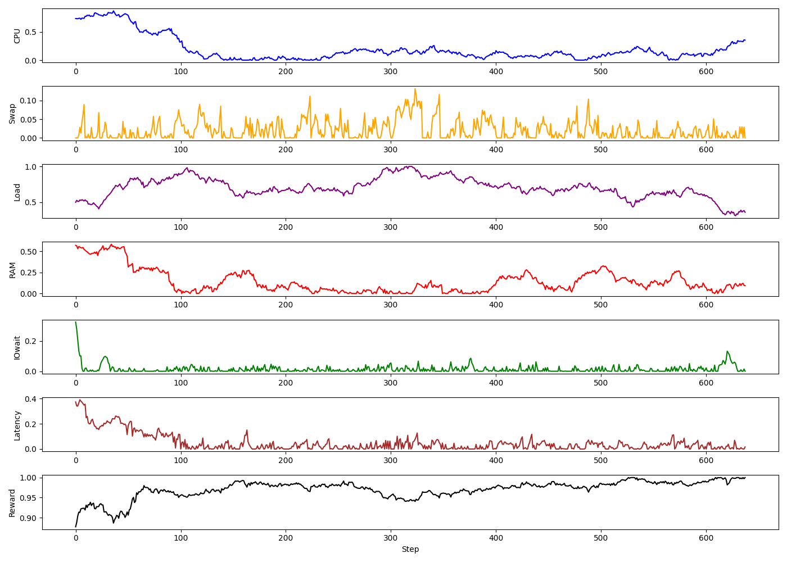

# RL-in-OS: Reinforcement Learning for Linux Kernel Optimization

This project explores the use of Reinforcement Learning (RL) to optimize Linux kernel parameters and improve system performance. The environment simulates system metrics, and an RL agent is trained to tune kernel parameters to achieve optimal performance.

## Table of Contents

- [Overview](#overview)
- [Features](#features)
- [Installation](#installation)
- [Usage](#usage)
- [Files](#files)
- [Results](#results)
- [Contributing](#contributing)
- [License](#license)

## Overview

The project uses the Proximal Policy Optimization (PPO) algorithm, implemented with [Stable-Baselines3](https://github.com/DLR-RM/stable-baselines3), to train an agent in a custom environment (`KernelTuneEnv`). The environment simulates system metrics such as CPU usage, RAM usage, I/O wait, and latency, and the agent learns to adjust kernel parameters to optimize these metrics.

## Features

- Custom Gymnasium environment (`KernelTuneEnv`) for simulating Linux kernel tuning.
- PPO-based RL agent for learning optimal parameter adjustments.
- Logging and visualization of system metrics during training and testing.
- Long-running evaluation of the trained model with detailed logs and plots.

## Installation

### 1. Clone the repository:
    git clone https://github.com/aedubois/RL 
    in-OS.git 

    cd RL-in-OS
    
### 2. Install the required dependencies:

    pip install -r requirements.txt
    
### 3. Install additional system tools:
- stress (for simulating system load):
    ```bash
    sudo apt install stress
    ```
- Ensure Python 3.8+ is installed.

## Usage

### 1. Simulate System Load
Run the simulate_desktop.sh script to simulate system load:

    bash simulate_desktop.sh
    
### 2. Train the PPO Agent
Train the RL agent using the ppo_train.py script:

    python ppo_train.py

### 3. Evaluate the Trained Model
Run the `ppo_long_run.py` script to evaluate the trained model:

    python ppo_long_run.py

After a keyboard interruption, this will generate logs and plots of system metrics.

### 4. View Results
- Logs: `ppo_long_run_log.csv`
- Plot: `ppo_long_run_plot.png`

## Files

- **`simulate_desktop.sh`**: Simulates system load for testing the RL agent.
- **`ppo_train.py`**: Script for training the PPO agent in the custom environment.
- **`ppo_long_run.py`**: Script for long-term evaluation of the trained model.
- **`linux_kernel_env.py`**: Custom Gymnasium environment for simulating Linux kernel tuning.
- **`requirements.txt`**: Python dependencies for the project.

## Results

The trained PPO agent learns to adjust kernel parameters to optimize system metrics. The results are logged and visualized, showing the agent's performance over time.

Example plot:


## Author
- **[Dubois Alexandre](https://github.com/aedubois)**
